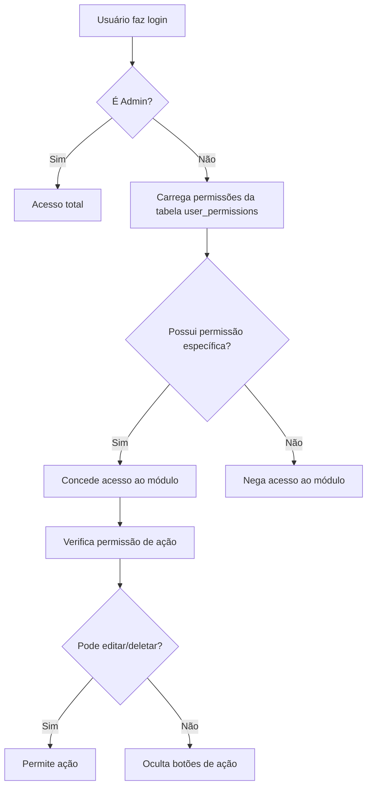

# Sistema de Permissões

## Visão Geral

O sistema de permissões da aplicação GDL Checklist é implementado em **dois níveis**:

1. **Permissões baseadas em Perfil** - Controle geral baseado no papel do usuário
2. **Permissões Granulares** - Controle específico por módulo/funcionalidade

## Arquitetura

### 1. Perfis de Usuário (Roles)

Armazenados na tabela `user_roles` e no campo `profile` da tabela `profiles`.

#### Perfis Disponíveis:
- **admin**: Acesso total ao sistema
- **gestor**: Acesso gerencial (sem gestão de usuários)
- **mecanico**: Acesso técnico (aprovações, status)
- **operador**: Acesso operacional básico

### 2. Permissões Granulares

Armazenadas na tabela `user_permissions`. Permite controle fino sobre o acesso a cada módulo.

#### Módulos Disponíveis:
- `dashboard` - Painel principal (sempre disponível)
- `checklist` - Criar e visualizar checklists
- `history` - Histórico de checklists
- `status` - Visualizar status de equipamentos
- `approvals` - Aprovar/rejeitar checklists
- `equipments` - Gerenciar equipamentos
- `equipment-management` - Painel de gestão de equipamentos
- `users` - Gerenciar usuários (apenas admin)

## Implementação Frontend

### Hook usePermissions

```typescript
const { canAccess, canEdit, canDelete } = usePermissions(user);

// Verificar acesso a um módulo
if (canAccess('equipments')) {
  // Renderizar conteúdo
}

// Verificar permissão de edição
if (canEdit('equipments')) {
  // Mostrar botão de editar
}

// Verificar permissão de exclusão
if (canDelete('equipments')) {
  // Mostrar botão de deletar
}
```

### Componentes de Proteção

#### PermissionGuard
Protege componentes inteiros baseado em permissões:

```typescript
<PermissionGuard permission="equipments">
  <EquipmentList />
</PermissionGuard>
```

#### EditGuard
Protege ações de edição:

```typescript
<EditGuard resource="equipments">
  <Button onClick={handleEdit}>Editar</Button>
</EditGuard>
```

#### DeleteGuard
Protege ações de exclusão:

```typescript
<DeleteGuard resource="equipments">
  <Button onClick={handleDelete}>Excluir</Button>
</DeleteGuard>
```

## Fluxo de Verificação



## Matriz de Permissões Padrão

| Perfil    | Dashboard | Checklist | History | Status | Approvals | Equipments | Management | Users |
|-----------|-----------|-----------|---------|--------|-----------|------------|------------|-------|
| Operador  | ✓         | ✓         | ✓       | ✓      | ✗         | ✗          | ✗          | ✗     |
| Mecânico  | ✓         | ✓         | ✓       | ✓      | ✓         | ✓          | ✓          | ✗     |
| Gestor    | ✓         | ✓         | ✓       | ✓      | ✓         | ✓          | ✓          | ✗     |
| Admin     | ✓         | ✓         | ✓       | ✓      | ✓         | ✓          | ✓          | ✓     |

## Ações por Perfil

### Operador
- ✓ Criar checklists
- ✓ Visualizar próprios checklists
- ✓ Visualizar histórico próprio
- ✓ Visualizar status de equipamentos
- ✗ Aprovar/rejeitar
- ✗ Gerenciar equipamentos
- ✗ Editar dados do sistema

### Mecânico
- ✓ Criar checklists
- ✓ Visualizar todos os checklists
- ✓ Aprovar/rejeitar checklists
- ✓ Alterar status de equipamentos
- ✓ Visualizar equipamentos
- ✗ Adicionar/editar equipamentos
- ✗ Gerenciar usuários

### Gestor
- ✓ Todas as permissões do mecânico
- ✓ Adicionar equipamentos
- ✓ Editar equipamentos
- ✓ Visualizar painel gerencial
- ✗ Gerenciar usuários

### Admin
- ✓ Acesso total
- ✓ Gerenciar usuários
- ✓ Alterar permissões
- ✓ Todas as ações do sistema

## Segurança Backend (RLS)

As permissões são reforçadas no backend através de Row-Level Security (RLS) no Supabase:

### Políticas Principais

```sql
-- Apenas admin pode gerenciar perfis
CREATE POLICY "Admins can manage all profiles"
ON profiles FOR ALL
USING (has_role(auth.uid(), 'admin'));

-- Apenas admin pode gerenciar roles
CREATE POLICY "Only admins can manage roles"
ON user_roles FOR ALL
USING (has_role(auth.uid(), 'admin'));

-- Apenas admin pode gerenciar permissões
CREATE POLICY "Only admins can manage permissions"
ON user_permissions FOR ALL
USING (has_role(auth.uid(), 'admin'));

-- Usuários podem ver seus próprios dados
CREATE POLICY "Users can view own data"
ON profiles FOR SELECT
USING (auth.uid() = id OR has_role(auth.uid(), 'admin'));
```

## Como Adicionar Novas Permissões

1. **Adicionar o ID da permissão** em `AVAILABLE_PERMISSIONS` no `UserManagement.tsx`
2. **Adicionar o tipo** no hook `usePermissions.ts`
3. **Criar política RLS** correspondente no banco de dados
4. **Usar PermissionGuard** nos componentes que precisam da permissão
5. **Documentar** neste arquivo

## Boas Práticas

✅ **SEMPRE** verificar permissões no frontend E no backend  
✅ **USAR** hooks e componentes de proteção em vez de verificações manuais  
✅ **OCULTAR** elementos que o usuário não pode acessar (melhor UX)  
✅ **VALIDAR** permissões ao fazer ações críticas  
✅ **LOGAR** tentativas de acesso não autorizado  

❌ **NUNCA** confiar apenas em verificações do frontend  
❌ **NUNCA** expor dados sensíveis em componentes protegidos  
❌ **NUNCA** permitir que usuários modifiquem suas próprias permissões  

## Troubleshooting

### Usuário não consegue acessar módulo permitido
1. Verificar se a permissão está cadastrada na tabela `user_permissions`
2. Verificar se o hook `usePermissions` está carregando corretamente
3. Verificar se há erros no console do navegador
4. Fazer logout e login novamente

### Permissões não atualizam em tempo real
1. O sistema usa Realtime do Supabase para atualizar permissões
2. Verificar se o subscription está ativo no `usePermissions`
3. Como alternativa, fazer logout e login novamente

### Admin não consegue acessar tudo
1. Verificar se o perfil está corretamente definido como 'admin' na tabela `profiles`
2. Verificar se há registro correspondente na tabela `user_roles`
3. Verificar as RLS policies no Supabase

## Auditoria e Logs

Para fins de segurança e auditoria, recomenda-se:
- Logar todas as tentativas de acesso negado
- Monitorar mudanças na tabela `user_permissions`
- Revisar periodicamente os acessos de cada usuário
- Implementar sistema de notificação para ações administrativas
